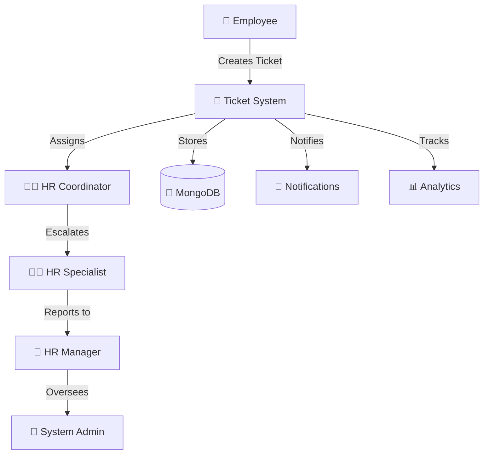

<div align="center">


<br/>

[](https://git.io/typing-svg)

<br/>

<p align="center">
  
  
  
  
  
  
</p>

<p align="center">
  
  
  
</p>

</div>

---

<div align="center">

## 🦁 About LionXcode

</div>

> **LionXcode** is a freelance development brand delivering high-quality, production-ready web applications. This project was built as **paid work** for a final year college student — crafted with full attention to detail, clean architecture, and real-world deployment.

<div align="center">

```
╔══════════════════════════════════════════════════════════╗
║                                                          ║
║   🦁  LionXcode  —  Code That Roars                     ║
║                                                          ║
║   Freelance · Full Stack · Production Ready              ║
║                                                          ║
╚══════════════════════════════════════════════════════════╝
```

</div>

---

<div align="center">

## 🎯 Project Overview

</div>

**TicketSolved** is a complete **HR Ticket Management System** built for a final year college project. It features a full role-based access system, real-time notifications, analytics dashboard, and MongoDB persistence — deployed live on Vercel.

<div align="center">



</div>

---

<div align="center">

## ✨ Features

</div>

<table align="center">
<tr>
<td align="center" width="33%">

### 🔐 Auth & Roles
- 5-tier role hierarchy
- Row-level security
- Sensitive category privacy wall
- Permission-based UI rendering

</td>
<td align="center" width="33%">

### 🎫 Ticket Management
- Create, assign, update, delete
- Status workflow tracking
- Internal notes (HR only)
- File attachments support

</td>
<td align="center" width="33%">

### 📊 Analytics
- Department-wise summary
- Priority & status charts
- HR team workload view
- Export: CSV, PDF, Print

</td>
</tr>
<tr>
<td align="center" width="33%">

### 🔔 Notifications
- Role-filtered bell alerts
- Unread count badge
- Click-to-navigate
- Mark all as read

</td>
<td align="center" width="33%">

### 📋 Templates
- 6 default ticket templates
- Custom template creation
- Preview before use
- Tag-based filtering

</td>
<td align="center" width="33%">

### 🏢 Directory
- Employee search & filter
- Department & role filters
- Contact info display
- 15 mock employees

</td>
</tr>
</table>

---

<div align="center">

## 🛠️ Tech Stack — Frontend

</div>

```yaml
Framework:    Next.js 15.2.6 (App Router)
Language:     TypeScript 5
Styling:      Tailwind CSS 3 + shadcn/ui
Animation:    Framer Motion
Icons:        Lucide React
Database:     MongoDB (via API routes)
PDF Export:   jsPDF + jsPDF-AutoTable
Deployment:   Vercel
```

---

<div align="center">

## 👥 Roles & Credentials

</div>

| Role | Username | Password |
|------|----------|----------|
| 👤 Employee | `alice.johnson` | `alice123` |
| 👤 Employee | `bob.martinez` | `bob123` |
| 👩‍💼 HR Coordinator | `carol.white` | `carol123` |
| 🧑‍💼 HR Specialist | `david.lee` | `david123` |
| 👔 HR Manager | `eva.chen` | `eva123` |
| 🔧 System Admin | `frank.admin` | `frank123` |

---

<div align="center">

## 🚀 Getting Started

</div>

```bash
# Clone the repository
git clone https://github.com/acelion55/HRMS_FRONTEND.git
cd HRMS_FRONTEND

# Install dependencies
npm install

# Set up environment variables
cp .env.example .env.local
# Add your MONGODB_URI and NEXT_PUBLIC_BACKEND_URL

# Run development server
npm run dev
```

---

<div align="center">

## 📁 Project Structure

</div>

```
front/
├── app/
│   ├── api/
│   │   ├── tickets/          # Ticket CRUD API routes
│   │   └── audit-logs/       # Audit log API routes
│   ├── layout.tsx
│   └── page.tsx              # Main app entry
├── components/
│   ├── hr/
│   │   ├── dashboard.tsx     # Main dashboard
│   │   ├── ticket-list.tsx   # Ticket list panel
│   │   ├── ticket-detail.tsx # Ticket detail panel
│   │   ├── analytics.tsx     # Charts & reports
│   │   ├── audit-log.tsx     # Audit trail
│   │   ├── role-management.tsx
│   │   ├── employee-directory.tsx
│   │   ├── ticket-templates.tsx
│   │   └── profile.tsx
│   └── ui/                   # shadcn/ui components
├── lib/
│   ├── data.ts               # Mock data + in-memory store
│   ├── types.ts              # TypeScript types
│   ├── permissions.ts        # RBAC logic
│   └── mongodb.ts            # DB connection
└── DOCUMENTATION.md
```

---

<div align="center">

## 🌐 Live Demo

<a href="https://ticketsolved-5m4c4xxv7-lionxcodes-projects.vercel.app">
  
</a>

<br/><br/>

---

## 🦁 Built by LionXcode


*This project was delivered as paid freelance work for a final year college student.*
*Clean code. Real deployment. Production quality.*

**LionXcode — Code That Roars 🦁**

</div>
